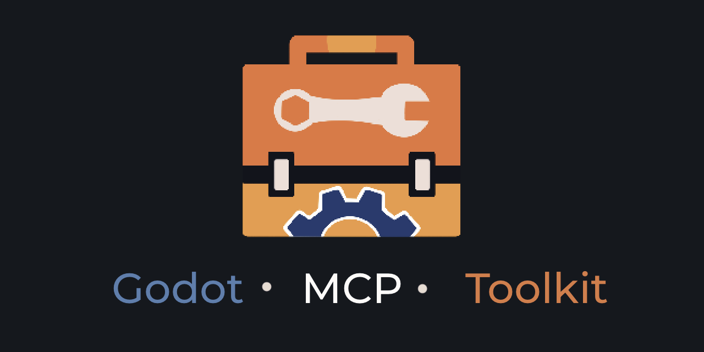
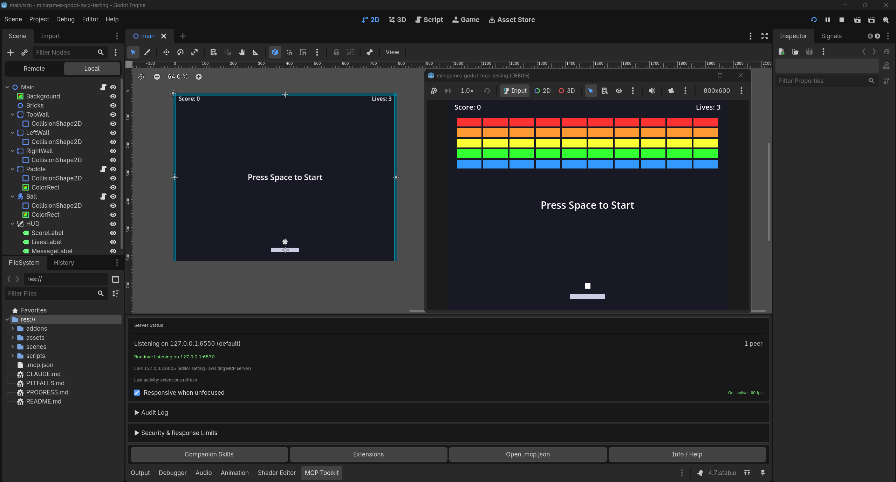
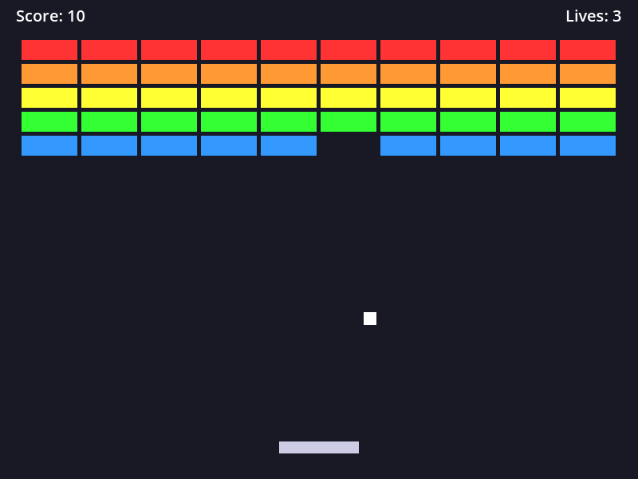

<!-- Brand banner, 1280×640, commissioned art; provenance in docs/media/README.md. Relative path so it resolves on github.com; this README is not in the AssetLib archive either way, since .gitattributes export-ignores every path outside addons/. -->


# Godot MCP Toolkit

[](https://github.com/NPGameDev/godot-mcp-toolkit/actions/workflows/ci.yml)

[](LICENSE)

AI-assisted Godot development through the [Model Context Protocol](https://modelcontextprotocol.io). This addon turns the Godot 4.2+ editor into an MCP server. Your AI coding assistant can create scenes, edit scripts, inspect nodes, run playtests, and read the results back, all inside the editor while you watch. The companion npm package [`@npgamedev/godot-mcp-server`](https://github.com/NPGameDev/godot-mcp-server) is the bridge your assistant talks to.

> Runs fully locally. No telemetry, no cloud services, no account. Nothing leaves your machine.
>
> This is an independent community project, not affiliated with or endorsed by the Godot Foundation or Anthropic.
>
> Desktop only: Windows, macOS, and Linux. The bridge needs Node.js 22 or newer.

<details>
<summary>New to MCP?</summary>

The [Model Context Protocol](https://modelcontextprotocol.io) is an open standard that lets an AI assistant use external tools. An MCP server describes what it can do (create a node, read a script, run the game), and any MCP-compatible assistant (Claude Code, Claude Desktop, Cursor, and others) can call those tools mid-conversation. This addon turns your Godot editor into one of those tool providers, and the companion npm server is the bridge your assistant talks to.

</details>

> 📐 **[Architecture →](docs/architecture/README.md)** covers how the toolkit is built: its subsystems, the editor/runtime split, and the transport and contract surface. Also rendered at [npgamedev.github.io/godot-mcp-toolkit/architecture](https://npgamedev.github.io/godot-mcp-toolkit/architecture/).

## Why this one?

*Built to fit your workflow, not the other way around.*

The number that says the most is **150+ operations**. That is the real work the toolkit does: create a node, paint a tilemap cell, key an animation track, read a live node mid-playtest, and roughly a hundred and fifty more. Those operations are packaged into **up to 112 tools** (an always-on core plus **28 on-demand groups**), because a tool is a slot in your client's tool budget and an operation is a thing you can actually do. Related actions sit behind one tool, which keeps the list short while the operation count tells the honest story of breadth. Some operations are version-gated, so older Godot versions (down to 4.2) expose fewer. "Up to" is literal.

Two things drive the design, and they carry equal weight:

- **You can extend it without a fixed ceiling.** The extension API lets you register your own tools in GDScript. They hot-reload and show up to the agent exactly like built-ins, and there is no fixed cap on how many you add. The limit is what the current system supports, and each iteration raises that ceiling and gives extensions more room. C#/.NET projects extend the same way, which is the proof that this fits every project instead of being a bolt-on. Heuristic or third-party-dependent tools stay out of the core on purpose, and the extension API is where they belong.
- **You can check the results.** The agent's context window is a budget, so the tool surface starts small (~8,800 tokens) and grows only when the agent asks for more. The evidence section below says what CI asserts on every build, what the test manifests cover, and what was measured when. Links, not adjectives.

Tested primarily with [Claude Code](https://docs.anthropic.com/en/docs/claude-code), and compatible with any MCP client.

## Quick start

### 1. Install the plugin

- **Godot AssetLib:** inside the editor, open the AssetLib tab, search "Godot MCP Toolkit", Download, Install.
- **Manual:** download from [GitHub Releases](https://github.com/NPGameDev/godot-mcp-toolkit/releases), extract into your project's `addons/` directory.

### 2. Enable it

Project Settings → Plugins → **Godot MCP Toolkit** → check **Active**.

You should see: the MCP dock appears in the bottom panel, and the Output log prints

```
[MCPServer] listening on 127.0.0.1:6550
```

(the port may land anywhere from 6550 to 6560; the dock's status section names the live one). That line is the plugin's own WebSocket server inside the editor. The npm bridge is a separate process your MCP client starts later, and it dials this port.

### 3. Write the client config

Let the plugin write it: **Project → Tools → MCP Toolkit → Write .mcp.json**.

The config runs the bridge through `npx -y @npgamedev/godot-mcp-server`, which fetches it on first connect, so there is no install step. (Requires Node.js 22 or newer. Run `node --version` to check.) If you would rather keep a fixed copy on the machine, `npm install -g @npgamedev/godot-mcp-server` works too.

You should see: `.mcp.json` at your project root, and the dock's `.mcp.json` section showing it healthy.

<details>
<summary>Prefer to write .mcp.json by hand?</summary>

```json
{
  "mcpServers": {
    "godot-mcp-toolkit": {
      "command": "npx",
      "args": ["-y", "@npgamedev/godot-mcp-server"]
    }
  }
}
```

On Windows, `npx` is a `.cmd` shim, so wrap it:

```json
{
  "mcpServers": {
    "godot-mcp-toolkit": {
      "command": "cmd",
      "args": ["/c", "npx", "-y", "@npgamedev/godot-mcp-server"]
    }
  }
}
```

</details>

<details>
<summary>Prefer to let the agent set it up?</summary>

Paste this into Claude Code from your project directory. It was tested end-to-end with Claude Code; other clients adapt via the server's [client setup guide](https://github.com/NPGameDev/godot-mcp-server/blob/main/docs/mcp-clients.md). The agent drives the command-line steps; you open the editor and reconnect the client when it asks.

```text
Set up the Godot MCP Toolkit for this project:
1. Write the client config (check Node >= 22 first). If this project has no .mcp.json,
   create one with a "godot-mcp-toolkit" server entry running
   "npx -y @npgamedev/godot-mcp-server" (on Windows, wrap with cmd /c). npx fetches the
   bridge on first connect, so no global install is needed; "npm install -g
   @npgamedev/godot-mcp-server" is only for pinning a fixed copy or working offline.
2. Fresh setup only: if addons/godot_mcp_toolkit exists but project.godot has no
   [editor_plugins] entry enabling it, add the enable line so the plugin loads on first launch.
   If this project is already open in Godot, tell me to enable it via Project Settings > Plugins instead,
   do not edit project.godot under a running editor.
3. Then STOP and tell me to: open the project in Godot, confirm the dock shows
   "[MCPServer] listening", and reconnect you (the MCP client) so the new config loads.
4. After I confirm, run one read-only probe (list the scene tree or read project settings)
   and report what you see.
```

</details>

### 4. Connect and ask for something

Launch your MCP client from the project root. It discovers the plugin and authenticates automatically. You should see the dock's peer count increment.

Then try the first prompt below. This is the kind of result it produces:

<!-- captured: pre-1.0, Godot 4.7, 2026-07-24, human-recorded (editor + MCP dock, 1 peer connected, game running); UI-chrome shots are hand-recorded per docs/media/README.md. -->


If a step does not produce its "you should see", head to the [troubleshooting guide](docs/troubleshooting.md). It starts with a 60-second checklist and a connectivity probe.

## Try asking…

1. *"Build a small brick-breaker: paddle, ball, a wall of bricks, a score label, and a game-over screen, then playtest it."*
2. *"Add a CharacterBody2D named Player to the main scene, with a Sprite2D and a CollisionShape2D under it."*
3. *"Create a main menu scene with a Start button that switches to the game scene when clicked."*
4. *"Run the game, then tell me the Player's position and velocity while it's running."*

The last three run in seconds. The first one is a real project, the same kind of small game we build end-to-end when validating a release, in a single agent session. Larger games span multiple sessions, with or without MCP.

<!-- captured: pre-1.0, Godot 4.5, 2026-07-24, via runtime_screenshot of the running brick-breaker (mid-flight). -->


*The brick-breaker from prompt 1 above.*

## What the tools cover

| Area | What the agent can do |
|------|----------------------|
| Scenes and nodes | Create, open, close, diff scenes; create, delete, reparent nodes; get and set any property; spatial map of positions and bounds |
| Scripts and language | Read, write, edit, validate GDScript; LSP-backed diagnostics, symbols, hover, completion, references |
| Resources, assets, files | Author `.tres` resources; import binary assets; list and trace dependencies; folder and file management |
| 2D and 3D authoring | Tilemap and tileset authoring, Path2D curves, 3D primitives, lights, cameras, environment, GPU particles, navigation polygons |
| Animation and audio | AnimationPlayer keyframes, AnimationTree state machines and blend trees, SpriteFrames, audio buses, placeholder texture and sound generation |
| Playtest and runtime | Start and stop the game; inspect live nodes, simulate input, read game logs, execute code in the running game; screenshots of editor and game |
| Debugging | Breakpoints, debug state, crash diagnostics, editor console capture |
| Editor and project | Project settings, input map, autoloads, filesystem scans, class database introspection |
| Extensions | Your own project-specific tools, registered in GDScript, hot-reloaded, called by the agent like built-ins |

The authoritative per-tool list is the server's generated [tool reference](https://github.com/NPGameDev/godot-mcp-server/blob/main/docs/tool-reference/README.md). Which tools exist on which Godot version is in the shipped [compatibility guide](addons/godot_mcp_toolkit/docs/compatibility.md).

## How it is designed

A few deliberate choices shape the tool surface:

- **Consolidated tools, counted operations.** Related actions share one tool with an action parameter instead of one tool each. The short tool list fits every client's tool budget and costs fewer context tokens; the 150+ operation count is what says how much the toolkit can really do.
- **Read/write discipline.** Every tool carries read-only and destructive annotations, so clients can auto-allow safe tools and gate risky ones. Read-only mode can hide every mutating tool with one switch.
- **Two channels.** The Editor channel operates on the scene being edited. The Runtime channel operates on the running game during a playtest. The split is architectural: the runtime piece ships export-clean and self-disables outside debug builds.
- **Some things are deliberately not tools.** Anything heuristic or opinionated (scene linting, auto-layout, balance tuning) stays out of the core, because a built-in that cries wolf erodes trust. The extension API is the home for those. Add your own, and official extension packs can follow where demand shows up.
- **Version-adaptive.** Tools degrade gracefully across Godot 4.2 to 4.7. Version-gated features report themselves clearly instead of failing cryptically.

## Extending it

Register your own MCP tools in GDScript: project-specific helpers the agent calls like built-ins, with hot-reload, per-tool timeouts, and cancellation. There is no fixed cap on how many you add. The ceiling is whatever the current system supports, and every iteration lifts it and makes extensions more flexible, so the customization you can build only grows over time. C# projects are supported too. Start with the shipped [extending guide](addons/godot_mcp_toolkit/docs/extending.md). The addon also bundles [agent skills](addons/godot_mcp_toolkit/docs/companion-skills.md), a workflow skill and an extension-authoring skill, that make an AI agent better at driving the toolkit; copy a skill folder into your client's skills directory to use them.

## How we know it works

CI fails the build if any of these numbers drift: **112 tools** (34 always-on + 2 meta, 78 on-demand) in **28 groups**, covering **150+ operations**; **39 tools** visible in read-only mode.

- Every tool has smoke coverage (happy path, guards, error hints), mapped in the server's [smoke coverage manifest](https://github.com/NPGameDev/godot-mcp-server/blob/main/test/SMOKE-COVERAGE-MANIFEST.md). Cross-tool stateful flows run as their own deterministic suite (`npm run flows`), and dispatch behavior (mutation serialization, cancellation, disconnects) as another. Separate suites, separately maintained.
- Every tool is also exercised end-to-end from GDScript in the interactive sweep, mapped in the [sweep coverage manifest](Validations/SWEEP-COVERAGE-MANIFEST.md). Last full pass: 479 cases on Godot 4.7 (2026-07-03); see [the sweep index](Validations/tool-sweep.md).
- CI exercises Godot **4.2 through 4.7**, on **Windows, macOS, and Linux**, in both **GDScript and C# (mono)** editors. The floor (static validation plus unit execution on every supported version) gates every push; the full behavioral matrix is an opt-in deep tier, and headless-incompatible sections (screenshots, display-bound input) are skipped there and validated locally.
- Five small games (a clicker, a brick-breaker, chess, a platformer, and a tower defense) were each built end-to-end in a single agent session as release validation.
- Concurrent human + AI editing is validated for specific scenarios: creating nodes during manual scene-tree edits, undo interleaving, editing a node while its Inspector is open, and mid-drag reparenting. Most overlap is safe; the two cases that need turn-taking are under [Known limitations](#known-limitations).

## Security

The default posture is localhost-only, token-authenticated, and auditable:

- **Session auth.** A random 64-character hex token is generated on every plugin start. The MCP server reads it from disk automatically, and unauthorized WebSocket connections are rejected.
- **Filesystem sandbox.** All file operations are restricted to `res://` by default. `FileGuard` blocks path traversal (`..`), absolute OS paths, and paths that resolve outside the boundary after lexical canonicalization, and it denies the plugin's own source directory. (Canonicalization is lexical, not OS-symlink resolution.)
- **Read-only mode and per-tool control.** Set `GODOT_MCP_READ_ONLY=1` in `.mcp.json` and the MCP server hides every mutating tool (code execution, method calls, `user://` writes, all `destructiveHint` tools) from the agent. That is a server-side guarantee, independent of the editor. For finer control, block individual high-risk tools through your agent's own permission system (for example, `.claude/settings.json` deny rules). See the shipped [security recommendations](addons/godot_mcp_toolkit/docs/security-recommendations.md).
- **Audit log.** Every tool call is logged with an ISO-8601 timestamp and parameter hash. Append-only, per-write flush for crash safety, configurable max size.
- **Response caps.** Script reads and WebSocket buffers are size-limited to prevent accidental exfiltration of large files.
- **Untrusted envelopes.** Content returned from the editor is wrapped in per-call nonce-tagged envelopes, which mitigates prompt injection from file contents.
- **Localhost only.** The WebSocket server binds `127.0.0.1` exclusively. Never `0.0.0.0`.

Vulnerability reporting, the supported-versions policy, and isolation guidance (containers, VMs, restricted accounts) live in [SECURITY.md](SECURITY.md).

> **Disclaimer:** We design every layer with defense-in-depth, but no software is immune to misuse or unforeseen vulnerabilities. This project is provided under the [MIT License](LICENSE) with no warranty. You are responsible for evaluating whether it meets your security requirements before use.

## Read-only mode

For supervised environments (classrooms, CI, demos), set `GODOT_MCP_READ_ONLY=1` in your `.mcp.json` env, or use the dock's read-only toggle, which writes it for you. Every mutating tool is hidden from the agent. Turn it off and reconnect the client to restore full access; the tool list is decided at connect time.

## Runtime channel

During playtests, the plugin injects an autoload that opens a second WebSocket server (default port 6570, scanned from 6570 to 6585). This is what the runtime tools use: inspecting live nodes, capturing game screenshots, simulating input, reading game logs, and executing code in the running game.

It activates automatically when your assistant uses `game_start` with `wait_for_runtime: true` (the default) and shuts down when the playtest ends. To pin the port, set `GODOT_MCP_RUNTIME_PORT` where **both** the editor process (which launches the game) and the server can see it. Details are in the shipped [advanced configuration guide](addons/godot_mcp_toolkit/docs/advanced_configuration.md).

Runtime tools exist only in debug builds: the runtime piece self-disables in exported games, and the bundled export plugin strips the addon (and its auth tokens) from shipped builds.

## Headless mode

Most tools work under `godot --headless --editor`: file, scene, node, script, ClassDB, and project tools all function without a display. Screenshots and anything needing a running game degrade with clear errors. The canonical per-tool headless matrix (tested on Godot 4.2.0 through 4.7.0) is in the shipped [compatibility guide](addons/godot_mcp_toolkit/docs/compatibility.md).

## Godot version support

**Minimum:** Godot 4.2 &nbsp; **Recommended:** Godot 4.5+ &nbsp; **Tested up to:** 4.7.0

| Godot | Level | Notes |
|-------|-------|-------|
| 4.2 to 4.3 | Core | Every tool except `scene_close` works (undo history included); toast notifications fall back to the Output panel |
| 4.4 | Full UI | Toast notifications added; `scene_close` still needs 4.5+ |
| 4.5+ | Full | All tools and UI features |

On 4.2 to 4.4 a few tools adapt rather than break: where the engine lacks an API, the tool falls back to a simpler path or replies with the exact version it needs. On 4.5+ the full toolset runs without fallbacks.

Future Godot versions (4.8+) are not blocked; the plugin uses runtime capability checks. Full per-version behavior, including degraded-mode details and the C# (.NET editor) requirement, is in the shipped [compatibility guide](addons/godot_mcp_toolkit/docs/compatibility.md).

## Known limitations

- **Dynamic tool loading needs a client that processes `tools/list_changed`.** Tools activated mid-session via `discover_tools` appear only if the MCP client handles that notification. Current Claude Code versions do, in both interactive and pipe (`claude -p`) mode (verified 2026-07-19); earlier versions did not process it in pipe mode. If newly activated tools do not appear, reconnect or upgrade the client.
- **Screenshot capture size.** A full-size viewport capture (a 3D viewport especially) can exceed the WebSocket transport buffer and fail with `RESPONSE_TOO_LARGE`. Pass `image_response_mode: "disk"` to save the PNG and receive its path, or request a lower `image_detail`.
- **Node-focus does not reframe a 2D node.** `editor_screenshot` with a `node_path` selects the node but, for a 2D node, does not pan or zoom the viewport to frame it. A 3D node-focus capture does get camera framing; 2D has no equivalent.
- **Un-minimizing restores a windowed state.** The `force_foreground_*` options un-minimize and raise a minimized window before capturing, but the window comes back windowed, not maximized. Godot exposes no API to restore the prior window mode.
- **Two concurrent-editing cases need turn-taking.** The editor stays usable while an agent works, and most overlap is safe: tree edits land cleanly during a manual drag, deleting an inspected node clears the Inspector, and Ctrl+Z reverts the most recent change first whether it was yours or the agent's. Two cases do not merge. If you have **unsaved** edits to a script open in the built-in editor and the agent writes that same file, the disk write wins and your buffer edits are lost, so save before letting an agent edit a file you are working in. And if the agent reparents or deletes the node you are mid-drag in the viewport, the structural change wins and your drag ends as a harmless no-op (a benign `Node not found` message may appear in the Output panel).

## FAQ

<details>
<summary><strong>Can it build a whole game in one shot?</strong></summary>

Small games, yes. Our validation minigames were each built in a single agent session (the brick-breaker in the examples above is one of them). Larger games take multiple sessions, with or without MCP.

</details>

<details>
<summary><strong>Can I use it commercially?</strong></summary>

Yes. MIT, both the addon and the server.

</details>

<details>
<summary><strong>Should I commit the addon to my game repo?</strong></summary>

Yes. The bundled export plugin strips it (and its auth tokens) from exported builds; the runtime piece self-disables outside debug builds.

</details>

<details>
<summary><strong>Does it work headless / in CI?</strong></summary>

Yes, with honest caveats: most tools work under `--headless --editor`; screenshots and everything needing a running game degrade. See the headless matrix in the shipped [compatibility guide](addons/godot_mcp_toolkit/docs/compatibility.md).

</details>

<details>
<summary><strong>C# projects?</strong></summary>

Supported. Use the mono (.NET) Godot editor build; the standard build cannot load `.cs` scripts. See the C# section of the shipped [compatibility guide](addons/godot_mcp_toolkit/docs/compatibility.md).

</details>

<details>
<summary><strong>Multiple editors or git worktrees?</strong></summary>

Yes. Per-project instance isolation (hash-based subdirectories) and per-editor port ranges. See the shipped [multi-instance guide](addons/godot_mcp_toolkit/docs/multi-instance.md).

</details>

<details>
<summary><strong>What leaves my machine?</strong></summary>

Nothing. Runs fully locally, no telemetry, no cloud services, no account.

</details>

## Documentation

- [Documentation map](docs/README.md): every doc, organized by what you want to do.
- [Troubleshooting](docs/troubleshooting.md): 60-second checklist, connectivity probe, symptom-to-fix entries.
- [Tool reference](https://github.com/NPGameDev/godot-mcp-server/blob/main/docs/tool-reference/README.md) (server repo, generated) and [token efficiency](https://github.com/NPGameDev/godot-mcp-server/blob/main/docs/token-efficiency.md): the measured context cost of the tool surface.
- [Companion-skill efficiency](https://github.com/NPGameDev/godot-mcp-server/blob/main/docs/companion-skill-efficiency.md) (server repo): the measured build-time savings from the bundled workflow skill.
- [Client setup](https://github.com/NPGameDev/godot-mcp-server/blob/main/docs/mcp-clients.md): per-client configuration beyond Claude Code.
- Shipped with the addon: [compatibility](addons/godot_mcp_toolkit/docs/compatibility.md), [security recommendations](addons/godot_mcp_toolkit/docs/security-recommendations.md), [extending](addons/godot_mcp_toolkit/docs/extending.md), [bundled agent skills](addons/godot_mcp_toolkit/docs/companion-skills.md), [multi-instance](addons/godot_mcp_toolkit/docs/multi-instance.md), [advanced configuration](addons/godot_mcp_toolkit/docs/advanced_configuration.md).

## Contributing

See [CONTRIBUTING.md](CONTRIBUTING.md) for environment setup, the test layers, and the documentation rules.

## Releases

This project follows [Semantic Versioning](https://semver.org/). The toolkit
plugin and the MCP server bridge are versioned independently; install the
latest of each and they negotiate compatibility at connect (see
[RELEASING.md](RELEASING.md) → Compatibility).

- **npm:** `npm install -g @npgamedev/godot-mcp-server@latest`
- **Godot Asset Store / AssetLib:** search "Godot MCP Toolkit" in the editor's
  AssetLib tab
- **GitHub Releases:** download from either repo's Releases page for manual installation

See [RELEASING.md](RELEASING.md) for maintainer release process and version policy.

## Author

**NPGameDev** · [npgamedev.com](https://npgamedev.com) · [GitHub](https://github.com/NPGameDev)

For inquiries and requests: [np@npgamedev.com](mailto:np@npgamedev.com)

## Trademarks

Godot and the Godot logo are trademarks of the Godot Foundation. This add-on is
an independent community project with no affiliation with or endorsement from the
Foundation, and it is not an official Godot product. The name describes what the
add-on runs on: the Godot Engine.

## License

MIT: see [LICENSE](LICENSE). Upstream notices in [ATTRIBUTIONS.md](ATTRIBUTIONS.md).
