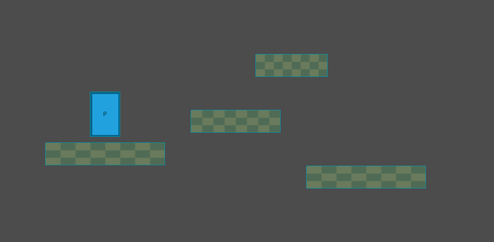

# Godot MCP Toolkit

[](https://github.com/NPGameDev/godot-mcp-toolkit/actions/workflows/ci.yml)

[](LICENSE)

AI-assisted Godot development through the [Model Context Protocol](https://modelcontextprotocol.io). This addon turns the Godot 4.2+ editor into an MCP server: your AI coding assistant can create scenes, edit scripts, inspect nodes, run playtests, and read the results — directly inside the editor, with you watching. The companion npm package [`@npgamedev/godot-mcp-server`](https://github.com/NPGameDev/godot-mcp-server) is the bridge your assistant talks to.

> Runs fully locally — no telemetry, no cloud services, no account. Nothing leaves your machine.
>
> This is an independent community project, not affiliated with or endorsed by the Godot Foundation or Anthropic.

<details>
<summary>New to MCP?</summary>

The [Model Context Protocol](https://modelcontextprotocol.io) is an open standard that lets an AI assistant use external tools. An MCP server describes what it can do (create a node, read a script, run the game), and any MCP-compatible assistant — Claude Code, Claude Desktop, Cursor, and others — can call those tools mid-conversation. This addon turns your Godot editor into such a tool provider; the companion npm server is the bridge your assistant talks to.

</details>

> 📐 **[Architecture →](docs/architecture/README.md)** — how the toolkit is built: its subsystems, the editor↔runtime split, and the transport/contract surface. Also rendered at [npgamedev.github.io/godot-mcp-toolkit/architecture](https://npgamedev.github.io/godot-mcp-toolkit/architecture/).

## Why this one?

*Built to fit your workflow, not the other way around.*

Up to **112 tools** (an always-on core plus **28 on-demand groups**) covering **150+ operations**. A tool is not an operation: we consolidate related actions behind one tool, so the tool count stays small enough to fit any client's tool budget while the operation count reflects what the toolkit can actually do. Some tools and operations are version-gated, so older Godot versions (down to 4.2) expose fewer — "up to" is literal.

Two things drive the design:

- **Extensibility and customization.** The extension API lets you add project-specific tools in GDScript; extensions hot-reload and appear to the agent like built-ins. C#/.NET projects are fully supported — evidence that it fits every project, not a separate feature. We deliberately keep heuristic or third-party-dependent tools out of the core; the extension API is how you add them.
- **Results you can check.** We treat the agent's context window as a budget: the tool surface starts small (~8,800 tokens) and grows only when the agent asks for more. The evidence section below lists what CI asserts on every build, what the test manifests cover, and what was measured when — links, not adjectives.

Tested primarily with [Claude Code](https://docs.anthropic.com/en/docs/claude-code); compatible with any MCP client.

## Quick start

### 1. Install the plugin

- **Godot AssetLib:** inside the editor, open the AssetLib tab, search "Godot MCP Toolkit", Download, Install.
- **Manual:** download from [GitHub Releases](https://github.com/NPGameDev/godot-mcp-toolkit/releases), extract into your project's `addons/` directory.

### 2. Enable it

Project Settings → Plugins → **Godot MCP Toolkit** → check **Active**.

You should see: the MCP dock appears in the bottom panel, and the Output log prints

```
[MCPServer] listening on 127.0.0.1:6550
```

(the port may land anywhere in 6550–6560; the dock's status section names the live one).

### 3. Install the bridge and write the config

```bash
npm install -g @npgamedev/godot-mcp-server
```

(Requires Node.js 22 or newer — `node --version` to check.) Then let the plugin write the client config: **Project → Tools → MCP Toolkit → Write .mcp.json**.

You should see: `.mcp.json` at your project root, and the dock's `.mcp.json` section showing it healthy.

<details>
<summary>Prefer to write .mcp.json by hand?</summary>

```json
{
  "mcpServers": {
    "godot-mcp-toolkit": {
      "command": "npx",
      "args": ["-y", "@npgamedev/godot-mcp-server"]
    }
  }
}
```

On Windows, `npx` is a `.cmd` shim, so wrap it:

```json
{
  "mcpServers": {
    "godot-mcp-toolkit": {
      "command": "cmd",
      "args": ["/c", "npx", "-y", "@npgamedev/godot-mcp-server"]
    }
  }
}
```

</details>

<details>
<summary>Prefer to let the agent set it up?</summary>

Paste this into Claude Code from your project directory. It was tested end-to-end with Claude Code; other clients adapt via the server's [client setup guide](https://github.com/NPGameDev/godot-mcp-server/blob/main/docs/mcp-clients.md). The agent drives the command-line steps; you open the editor and reconnect the client when it asks.

```text
Set up the Godot MCP Toolkit for this project:
1. Install the bridge: npm install -g @npgamedev/godot-mcp-server (check Node >= 22 first).
2. If this project has no .mcp.json, create one with a "godot-mcp-toolkit" server entry
   running "npx -y @npgamedev/godot-mcp-server" (on Windows, wrap with cmd /c).
3. Fresh setup only: if addons/godot_mcp_toolkit exists but project.godot has no
   [editor_plugins] entry enabling it, add the enable line so the plugin loads on first launch.
   If this project is already open in Godot, tell me to enable it via Project Settings > Plugins instead —
   do not edit project.godot under a running editor.
4. Then STOP and tell me to: open the project in Godot, confirm the dock shows
   "[MCPServer] listening", and reconnect you (the MCP client) so the new config loads.
5. After I confirm, run one read-only probe (list the scene tree or read project settings)
   and report what you see.
```

</details>

### 4. Connect and ask for something

Launch your MCP client from the project root — it discovers the plugin and authenticates automatically. You should see the dock's peer count increment.

Then try the first prompt below. This is the kind of result it produces:

<!-- captured: pre-1.0, Godot 4.5, 2026-07-19, via editor_screenshot against an agent-built scene; cropped to the content region of the native viewport capture. -->


If a step does not produce its "you should see", head to the [troubleshooting guide](docs/troubleshooting.md) — it starts with a 60-second checklist and a connectivity probe.

## Try asking…

1. *"Add a CharacterBody2D named Player to the main scene, with a Sprite2D and a CollisionShape2D under it."*
2. *"Create a main menu scene with a Start button that switches to the game scene when clicked."*
3. *"Run the game, then tell me the Player's position and velocity while it's running."*
4. *"Build a small brick-breaker: paddle, ball, a wall of bricks, a score label, and a game-over screen — then playtest it."*

The first three run in seconds. The last one is a real project: the same kind of small game we build end-to-end when validating a release, in a single agent session. Larger games span multiple sessions, with or without MCP.

## What the tools cover

| Area | What the agent can do |
|------|----------------------|
| Scenes and nodes | Create, open, close, diff scenes; create, delete, reparent nodes; get and set any property; spatial map of positions and bounds |
| Scripts and language | Read, write, edit, validate GDScript; LSP-backed diagnostics, symbols, hover, completion, references |
| Resources, assets, files | Author `.tres` resources; import binary assets; list and trace dependencies; folder and file management |
| 2D and 3D authoring | Tilemap and tileset authoring, Path2D curves, 3D primitives, lights, cameras, environment, GPU particles, navigation polygons |
| Animation and audio | AnimationPlayer keyframes, AnimationTree state machines and blend trees, SpriteFrames, audio buses, placeholder texture and sound generation |
| Playtest and runtime | Start and stop the game; inspect live nodes, simulate input, read game logs, execute code in the running game; screenshots of editor and game |
| Debugging | Breakpoints, debug state, crash diagnostics, editor console capture |
| Editor and project | Project settings, input map, autoloads, filesystem scans, class database introspection |
| Extensions | Your own project-specific tools, registered in GDScript, hot-reloaded — the agent calls them like built-ins |

The authoritative per-tool list is the server's generated [tool reference](https://github.com/NPGameDev/godot-mcp-server/blob/main/docs/tool-reference/README.md). Which tools exist on which Godot version is in the shipped [compatibility guide](addons/godot_mcp_toolkit/docs/compatibility.md).

## How it is designed

A few deliberate choices shape the tool surface:

- **Consolidated tools.** Related actions share one tool with an action parameter instead of registering one tool each. A small tool list fits every client's tool budget and costs fewer context tokens, while the operation count stays honest about breadth.
- **Read/write discipline.** Every tool carries read-only and destructive annotations, so clients can auto-allow safe tools and gate risky ones — and read-only mode can hide every mutating tool with one switch.
- **Two channels.** The Editor channel operates on the scene being edited; the Runtime channel operates on the running game during a playtest. The split is architectural: the runtime piece ships export-clean and self-disables outside debug builds.
- **Some things are deliberately not tools.** Anything heuristic or opinionated (scene linting, auto-layout, balance tuning) stays out of the core — a built-in that cries wolf erodes trust. The extension API is the home for those: add your own, and official extension packs can follow where demand shows up.
- **Version-adaptive.** Tools degrade gracefully across Godot 4.2–4.7: version-gated features report themselves clearly instead of failing cryptically.

## Extending it

Register your own MCP tools in GDScript — project-specific helpers the agent calls like built-ins, with hot-reload, per-tool timeouts, and cancellation. C# projects are supported. Start with the shipped [extending guide](addons/godot_mcp_toolkit/docs/extending.md). The addon also bundles companion agent skills (`addons/godot_mcp_toolkit/CompanionSkills/`) — including one that walks an agent through building an extension — copy a skill folder into your client's skills directory to use them.

## How we know it works

CI fails the build if any of these numbers drift: **112 tools** (34 always-on + 2 meta, 78 on-demand) in **28 groups**, covering **150+ operations**; **39 tools** visible in read-only mode.

- Every tool has smoke coverage (happy path, guards, error hints) — mapped in the server's [smoke coverage manifest](https://github.com/NPGameDev/godot-mcp-server/blob/main/test/SMOKE-COVERAGE-MANIFEST.md). Cross-tool stateful flows run as their own deterministic suite (`npm run flows`), and dispatch behavior (mutation serialization, cancellation, disconnects) as another — separate suites, separately maintained.
- Every tool is also exercised end-to-end from GDScript in the interactive sweep — mapped in the [sweep coverage manifest](Validations/SWEEP-COVERAGE-MANIFEST.md). Last full pass: 479 cases on Godot 4.7 (2026-07-03); see [the sweep index](Validations/tool-sweep.md).
- CI exercises Godot **4.2 through 4.7**, on **Windows, macOS, and Linux**, in both **GDScript and C# (mono)** editors. The floor — static validation plus unit execution on every supported version — gates every push; the full behavioral matrix is an opt-in deep tier, and headless-incompatible sections (screenshots, display-bound input) are skipped there and validated locally.
- Five small games — a clicker, a brick-breaker, chess, a platformer, and a tower defense — were each built end-to-end in a single agent session as release validation.
- Concurrent human + AI editing is validated for specific scenarios: creating nodes during manual scene-tree edits, undo interleaving, editing a node while its Inspector is open, and mid-drag reparenting. Complex viewport interactions may benefit from taking turns; and if you have unsaved changes in the built-in script editor and a tool writes the same file, your buffer wins on save — save or close first.

## Security

The default posture is localhost-only, token-authenticated, and auditable:

- **Session auth** — A random 64-character hex token is generated on every plugin start. The MCP server reads it from disk automatically; unauthorized WebSocket connections are rejected.
- **Filesystem sandbox** — All file operations are restricted to `res://` by default. `FileGuard` blocks path traversal (`..`), absolute OS paths, and paths that resolve outside the boundary after lexical canonicalization, and denies the plugin's own source directory. (Canonicalization is lexical — not OS-symlink resolution.)
- **Read-only mode & per-tool control** — Set `GODOT_MCP_READ_ONLY=1` in `.mcp.json` and the MCP server hides every mutating tool (code execution, method calls, `user://` writes — all `destructiveHint` tools) from the agent: a server-side guarantee, independent of the editor. For finer control, block individual high-risk tools through your agent's own permission system (e.g. `.claude/settings.json` deny rules). See the shipped [security recommendations](addons/godot_mcp_toolkit/docs/security-recommendations.md).
- **Audit log** — Every tool call is logged with an ISO-8601 timestamp and parameter hash. Append-only, per-write flush for crash safety, configurable max size.
- **Response caps** — Script reads and WebSocket buffers are size-limited to prevent accidental exfiltration of large files.
- **Untrusted envelopes** — Content returned from the editor is wrapped in per-call nonce-tagged envelopes, mitigating prompt injection from file contents.
- **Localhost only** — The WebSocket server binds `127.0.0.1` exclusively. Never `0.0.0.0`.

Vulnerability reporting, the supported-versions policy, and isolation guidance (containers, VMs, restricted accounts) live in [SECURITY.md](SECURITY.md).

> **Disclaimer:** We design every layer with defense-in-depth, but no software is immune to misuse or unforeseen vulnerabilities. This project is provided under the [MIT License](LICENSE) with no warranty. You are responsible for evaluating whether it meets your security requirements before use.

## Read-only mode

For supervised environments (classrooms, CI, demos), set `GODOT_MCP_READ_ONLY=1` in your `.mcp.json` env — or use the dock's read-only toggle, which writes it for you. Every mutating tool is hidden from the agent. Turn it off and reconnect the client to restore full access; the tool list is decided at connect time.

## Runtime channel

During playtests, the plugin injects an autoload that opens a second WebSocket server (default port 6570, scanned from 6570–6585). This is what the runtime tools use: inspecting live nodes, capturing game screenshots, simulating input, reading game logs, and executing code in the running game.

It activates automatically when your assistant uses `game_start` with `wait_for_runtime: true` (the default) and shuts down when the playtest ends. To pin the port, set `GODOT_MCP_RUNTIME_PORT` where **both** the editor process (which launches the game) and the server can see it — details in the shipped [advanced configuration guide](addons/godot_mcp_toolkit/docs/advanced_configuration.md).

Runtime tools exist only in debug builds: the runtime piece self-disables in exported games, and the bundled export plugin strips the addon (and its auth tokens) from shipped builds.

## Headless mode

Most tools work under `godot --headless --editor` — file, scene, node, script, ClassDB, and project tools all function without a display; screenshots and anything needing a running game degrade with clear errors. The canonical per-tool headless matrix (tested on Godot 4.2.0 through 4.7.0) is in the shipped [compatibility guide](addons/godot_mcp_toolkit/docs/compatibility.md).

## Godot version support

**Minimum:** Godot 4.2 &nbsp; **Recommended:** Godot 4.5+ &nbsp; **Tested up to:** 4.7.0

| Godot | Level | Notes |
|-------|-------|-------|
| 4.2 – 4.3 | Core | All tools work (undo history included); toast notifications fall back to the Output panel |
| 4.4 | Full UI | Toast notifications added; `scene_close` unavailable |
| 4.5+ | Full | All tools and UI features |

Future Godot versions (4.8+) are not blocked — the plugin uses runtime capability checks. Full per-version behavior, including degraded-mode details and the C# (.NET editor) requirement: the shipped [compatibility guide](addons/godot_mcp_toolkit/docs/compatibility.md).

## Known limitations

- **Dynamic tool loading needs a client that processes `tools/list_changed`.** Tools activated mid-session via `discover_tools` appear only if the MCP client handles that notification. Current Claude Code versions do, in both interactive and pipe (`claude -p`) mode — verified 2026-07-19; earlier versions did not process it in pipe mode. If newly activated tools do not appear, reconnect or upgrade the client.
- **Screenshot capture size.** A full-size viewport capture (a 3D viewport especially) can exceed the WebSocket transport buffer and fail with `RESPONSE_TOO_LARGE`. Pass `image_response_mode: "disk"` to save the PNG and receive its path, or request a lower `image_detail`.
- **Node-focus does not reframe a 2D node.** `editor_screenshot` with a `node_path` selects the node but, for a 2D node, does not pan or zoom the viewport to frame it. A 3D node-focus capture does get camera framing; 2D has no equivalent.
- **Un-minimizing restores a windowed state.** The `force_foreground_*` options un-minimize and raise a minimized window before capturing, but the window comes back windowed, not maximized — Godot exposes no API to restore the prior window mode.

## FAQ

<details>
<summary><strong>Can it build a whole game in one shot?</strong></summary>

Small games, yes — our validation minigames were each built in a single agent session (the brick-breaker in the examples above is one of them). Larger games take multiple sessions, with or without MCP.

</details>

<details>
<summary><strong>Can I use it commercially?</strong></summary>

Yes — MIT, both the addon and the server.

</details>

<details>
<summary><strong>Should I commit the addon to my game repo?</strong></summary>

Yes. The bundled export plugin strips it (and its auth tokens) from exported builds; the runtime piece self-disables outside debug builds.

</details>

<details>
<summary><strong>Does it work headless / in CI?</strong></summary>

Yes, with honest caveats: most tools work under `--headless --editor`; screenshots and everything needing a running game degrade — see the headless matrix in the shipped [compatibility guide](addons/godot_mcp_toolkit/docs/compatibility.md).

</details>

<details>
<summary><strong>C# projects?</strong></summary>

Supported — use the mono (.NET) Godot editor build; the standard build cannot load `.cs` scripts. See the C# section of the shipped [compatibility guide](addons/godot_mcp_toolkit/docs/compatibility.md).

</details>

<details>
<summary><strong>Multiple editors or git worktrees?</strong></summary>

Yes — per-project instance isolation (hash-based subdirectories) and per-editor port ranges. See the shipped [multi-instance guide](addons/godot_mcp_toolkit/docs/multi-instance.md).

</details>

<details>
<summary><strong>What leaves my machine?</strong></summary>

Nothing — runs fully locally, no telemetry, no cloud services, no account.

</details>

## Documentation

- [Documentation map](docs/README.md) — every doc, organized by what you want to do.
- [Troubleshooting](docs/troubleshooting.md) — 60-second checklist, connectivity probe, symptom-to-fix entries.
- [Tool reference](https://github.com/NPGameDev/godot-mcp-server/blob/main/docs/tool-reference/README.md) (server repo, generated) and [token efficiency](https://github.com/NPGameDev/godot-mcp-server/blob/main/docs/token-efficiency.md) — the measured context cost of the tool surface.
- [Client setup](https://github.com/NPGameDev/godot-mcp-server/blob/main/docs/mcp-clients.md) — per-client configuration beyond Claude Code.
- Shipped with the addon: [compatibility](addons/godot_mcp_toolkit/docs/compatibility.md), [security recommendations](addons/godot_mcp_toolkit/docs/security-recommendations.md), [extending](addons/godot_mcp_toolkit/docs/extending.md), [multi-instance](addons/godot_mcp_toolkit/docs/multi-instance.md), [advanced configuration](addons/godot_mcp_toolkit/docs/advanced_configuration.md).

## Contributing

See [CONTRIBUTING.md](CONTRIBUTING.md) — environment setup, the test layers, and the documentation rules.

## License

MIT — see [LICENSE](LICENSE). Upstream notices in [ATTRIBUTIONS.md](ATTRIBUTIONS.md).
