# Godot MCP Toolkit — Architecture

> **Architecture as of `8a1496e`** — 41n-series finalization: the runtime-autoload
> identity/registration was split out of the plugin orchestrator into a pure-const leaf
> (`core/autoload_identity.gd`) plus a behaviour module (`core/autoload_registration.gd`),
> shared with the export-strip domain ([ADR 0013](#14-key-decisions-adrs)); listen ports gained
> deterministic env-driven pin/band config (`transport/port_config.gd`, bind-exact-or-fail;
> [ADR 0015](#14-key-decisions-adrs)); `.mcp.json` emission became OS-aware
> ([ADR 0016](#14-key-decisions-adrs)), and its macOS absolute-node auto-emit
> ([ADR 0017](#14-key-decisions-adrs)) was reverted to a plain per-OS `npx` command by
> [ADR 0018](#14-key-decisions-adrs) after a real-Mac finding;
> the Mode-A handshake added a `headless` field ([ADR 0014](#14-key-decisions-adrs)); dispatch
> cancellation keys were peer-scoped; and the support ceiling reached Godot 4.7. Structural
> baseline unchanged from the 41n cohesion refactor (thin orchestrators over
> single-responsibility children; DDD domain folders such as `commands/`, `contract/`,
> `transport/`, `registry/`, `extensions/`; the `Modules` preload registry + the `EditorAccess`
> facade). Latest change — macOS `.mcp.json` emission reverted to bare npx (ADR 0018
> supersedes 0017).

This document explains how the toolkit is built, for users and contributors who want to
understand it without reading all 113 GDScript files. It covers the major subsystems and
their responsibilities, the boundaries between them — especially the **editor↔runtime
split** — the **transport + contract surface** the server depends on, and the key design
decisions (linked to the ADRs).

The toolkit is the **editor-side half** of a two-repo system. It turns a running Godot 4.2+
editor (and, separately, a running game) into a localhost MCP server. The other half — the
[`godot-mcp-server`](https://github.com/NPGameDev/godot-mcp-server) npm bridge — is what an
AI assistant actually speaks MCP to; the bridge forwards calls to this toolkit over a
WebSocket. This doc is about the toolkit; the wire contract between them is summarised in
[§13](#13-contract-surface).

---

## Maintaining this document

This file is the **canonical** architecture doc. It renders two ways from one source:

- **On github.com** — browsing to `docs/architecture/` auto-renders this `README.md`,
  Mermaid diagrams included, with **zero setup**. This is the always-available surface.
- **On GitHub Pages** — `just-the-docs` renders the *same* file as the polished, searchable
  front door (nav + native Mermaid). One source, two surfaces — **there is no hand-authored
  HTML twin.**

The rules that keep it honest:

1. **Every diagram is Mermaid source** (a fenced ` ```mermaid ` block) — never a pasted
   image. A raster can show what a UI *looks like*, but **no architectural claim may rest on
   a picture an agent cannot read** (that is how diagrams silently drift out of sync).
2. **Each diagram carries a provenance comment** immediately above its fence:
   `<!-- data-depicts="<source files>" data-verified="<short-sha>" -->`. `data-depicts` lists
   the files the diagram is drawn from; `data-verified` is the commit it was last
   checked-correct against. **Bumping `data-verified` is an attestation** that a human or
   agent re-read the diagram against the code at that SHA — it is never auto-generated. The
   comment is invisible on both render surfaces.
3. **When the architecture changes**, edit the affected diagram's Mermaid source, bump its
   `data-verified`, and update the **document-level stamp** at the top (the SHA + one-line
   definition of the last major architectural change).
4. **Find what to re-check** by grepping `data-depicts` for a file you changed; an advisory,
   non-blocking freshness check (`scripts/check_arch_freshness.sh`) lists diagrams whose
   depicted files moved since their `data-verified` SHA. It over-flags by design — a false
   re-check costs a glance; a missed drift ships a lying diagram.

Diagrams below are verified against `eb4c9fa` (the 41n-series finalization) — each diagram's own
`data-verified` comment is authoritative.

---

## 1. The big picture

An AI assistant talks **MCP** to the npm bridge; the bridge talks **JSON-RPC over a
localhost WebSocket** to the toolkit. The toolkit runs **two** servers — one inside the
**editor** (Mode A, for authoring) and one inside a **running game** (Mode B, for runtime
inspection) — and publishes a small **registry file** so the bridge can discover every live
instance on the machine.

<!-- data-depicts="addons/godot_mcp_toolkit/transport/mcp_server.gd addons/godot_mcp_toolkit/runtime/mcp_runtime_server.gd addons/godot_mcp_toolkit/registry/registry_client.gd" data-verified="9d46db6" -->
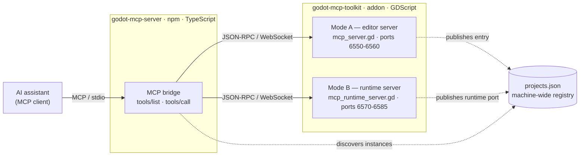
*Figure 1 — system context · verified 9d46db6*

Everything binds to `127.0.0.1` and is gated by a per-instance auth token; the real security
boundary is **localhost + token + a human at the editor** (see [§10](#10-security--trust-boundaries)).

The addon is organised into domain folders that map almost one-to-one onto the sections
below:

| Folder | Responsibility | Section |
|--------|----------------|---------|
| `transport/` + `transport/dispatch/` | editor server, WebSocket framing, request routing, concurrency lanes | [§3](#3-transport--connection), [§4](#4-dispatch--concurrency) |
| `runtime/` | the in-game (Mode B) server | [§2](#2-the-editorruntime-split), [§3](#3-transport--connection) |
| `contract/` | response envelope, error codes, type coercion, the command registry | [§5](#5-the-response-contract), [§6](#6-command-registry--catalogue) |
| `commands/` | the ~100 built-in tool handlers | [§6](#6-command-registry--catalogue) |
| `core/` | plugin composition root, tool menu, the `Modules` preload registry, `EditorAccess` | [§7](#7-plugin-lifecycle) |
| `extensions/` | third-party extension discovery, loading, hot-reload | [§8](#8-extension-system) |
| `registry/` + `registry/store/` | multi-instance discovery (`projects.json`) | [§9](#9-multi-project-registry) |
| `security/` | auth token, path guard, audit log, untrusted-content wrapping | [§10](#10-security--trust-boundaries) |
| `paths/`, `logging/`, `scene/`, `versioning/`, `ui/` | supporting services and the dock | throughout |

---

## 2. The editor↔runtime split

This is the **single most important seam** in the toolkit, and it is enforced by the GDScript
parser, not by a runtime `if`.

GDScript resolves identifiers at **parse time**, *before* any `Engine.is_editor_hint()` /
`OS.has_feature("editor")` guard runs. So a script that merely **names** an editor-only type
(`EditorInterface`, `EditorPlugin`, `EditorSettings`, …) — or `preload`s one that does — fails
to *load* with a parse error in any export where it ships unstripped
([`godotengine/godot#91713`](https://github.com/godotengine/godot/issues/91713), unfixed 4.2–4.6).
Runtime guards gate **behaviour**; they cannot gate **parsing**. Therefore the split must be by
the **static dependency graph**.

The **runtime server** (`runtime/mcp_runtime_server.gd`, Mode B) ships inside the player's
exported game, so its entire `preload` closure must be **export-clean** — name no editor type,
transitively. The **editor server** (`transport/mcp_server.gd`, Mode A) has no such constraint
and freely reaches `EditorInterface`.

<!-- data-depicts="addons/godot_mcp_toolkit/runtime/mcp_runtime_server.gd addons/godot_mcp_toolkit/transport/mcp_server.gd addons/godot_mcp_toolkit/transport/port_config.gd addons/godot_mcp_toolkit/contract/property_set_check.gd" data-verified="9d46db6" -->
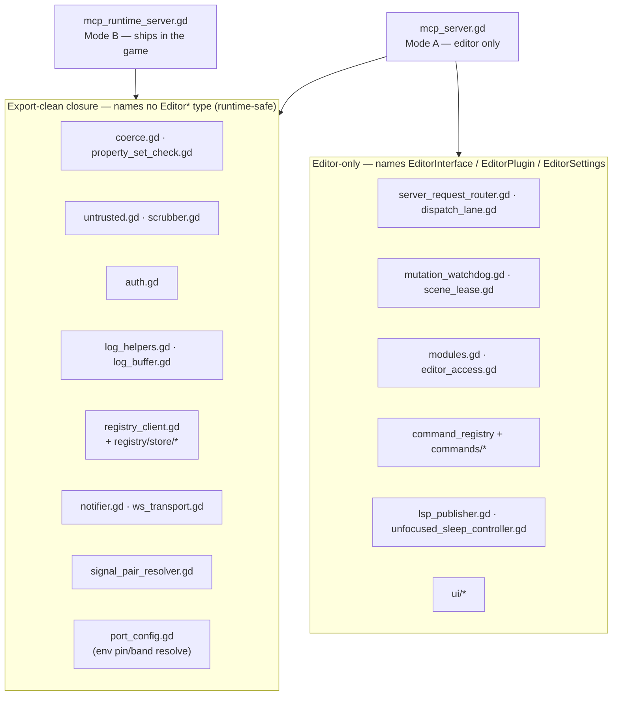
*Figure 2 — the editor↔runtime taint boundary · verified 9d46db6*

Consequences that shape the rest of the architecture:

- **Shared infrastructure lives in the clean set.** `ws_transport.gd` (TCP/WebSocket
  lifecycle + framing) and `notifier.gd` (JSON-RPC send/broadcast) are used by **both**
  servers, so they name no editor type. `port_config.gd` (env-driven listen-port resolution,
  [§3](#3-transport--connection)) is likewise preloaded by both, so it reads only `OS`
  environment and names no editor type. `registry_client.gd` is `@tool` but editor-clean —
  it takes the LSP host/port as *parameters* rather than reading `EditorSettings`, precisely
  so the runtime can preload it ([ADR 0008](#14-key-decisions-adrs)).
- **Mode B is deliberately smaller.** It has no mutation queue, no scene lease, and no
  dispatcher lanes; it dispatches a fixed handful of `runtime.*` / `signal.*` / `input.*` /
  `execute.*` handlers inline. Anything needing the editor (saving scenes, undo/redo,
  filesystem scans) is Mode-A-only by construction.
- **The runtime autoload self-disables three ways** in `_ready()`: it returns inert if
  `Engine.is_editor_hint()`, if `--check-only` is on the command line, or — the security-load-bearing
  one — if `not OS.has_feature("editor")`, which is **false in every export template**. A
  shipped game never starts the server; only an `editor`-feature build (the dev running their
  own game from the editor) does.

The export-strip plugin ([ADR 0006](#14-key-decisions-adrs)) nulls the runtime autoload entry
and strips addon source from the player's build as defence-in-depth, but the parse-time
discipline above is what actually keeps the game from crashing on a stray editor reference.

---

## 3. Transport & connection

Both servers share the same shape: a `TCPServer` on a scanned localhost port, each accepted
connection upgraded to a `WebSocketPeer`, one JSON object per frame, and a mandatory
first-frame auth handshake. The shared mechanics live in `ws_transport.gd` (listen / accept /
poll / auth framing) and `notifier.gd` (result / error / notification / broadcast). The two
servers differ only in what they inject into that base and how they pump it.

<!-- data-depicts="addons/godot_mcp_toolkit/transport/ws_transport.gd addons/godot_mcp_toolkit/transport/mcp_server.gd addons/godot_mcp_toolkit/transport/dispatch/server_request_router.gd addons/godot_mcp_toolkit/security/auth.gd" data-verified="eb4c9fa" -->
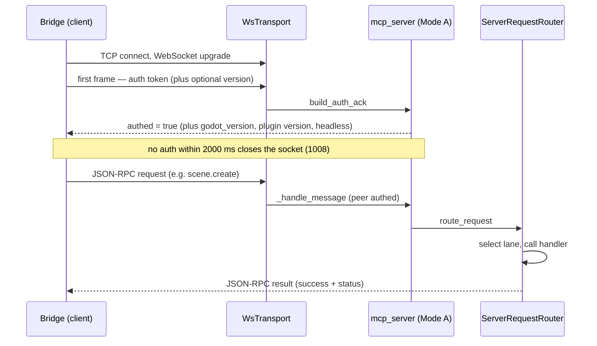
*Figure 3 — connect → auth handshake → dispatch · verified eb4c9fa*

**Ports & framing.** By default Mode A scans `6550–6560` and Mode B scans `6570–6585`; both
bind `127.0.0.1`. The listen configuration is resolved from the environment by the shared,
export-clean `transport/port_config.gd`: a per-channel env var pins an exact port
(`GODOT_MCP_EDITOR_PORT` / `GODOT_MCP_RUNTIME_PORT`, **bind-exact-or-fail** with a bounded
same-port grace — never a silent scan-fallback), or a `*_PORT_MIN` / `*_PORT_MAX` pair relocates
the scan band; pin and band are mutually exclusive per channel, and a malformed or out-of-range
value is a fatal config error, never a silent clamp ([ADR 0015](#14-key-decisions-adrs)). The
registry always publishes the *actually bound* port, including a pinned port that frees and binds
late. The editor peer buffer is sized from the `mcp_toolkit/limits/ws_buffer_kb` ProjectSetting
(default 1024 KiB). A response frame larger than the peer buffer is **dropped wholesale by the
engine** (no chunking), which is why oversized reads are guarded centrally and `save.read` /
`script.read` paginate.

**Auth.** The token is a 256-bit CSPRNG value (`auth.gd`), written to a per-instance file; its
**globalized absolute path** is published in the registry entry (`get_published_token_path()` —
`ProjectSettings.globalize_path` of the `user://` token file) so the bridge can read **and
structurally validate** it without re-deriving the path ([ADR 0011](#14-key-decisions-adrs)).
In-engine readers keep the `user://` form. The handshake reply differs by mode: Mode A returns
`godot_version` + plugin `version` + a `headless` flag (the server's version-gating and
headless-degradation inputs; [ADR 0014](#14-key-decisions-adrs)), Mode B returns
`{"authed":true}` only.

**The editor poll loop is deliberately indirect.** Editor mutations must not run re-entrantly
inside `_process` (a scene save pumps the main loop, which could resume a coroutine mid-pump).
So Mode A defers its poll and throttles it to every 4th frame:

<!-- data-depicts="addons/godot_mcp_toolkit/transport/mcp_server.gd addons/godot_mcp_toolkit/transport/ws_transport.gd" data-verified="eb4c9fa" -->
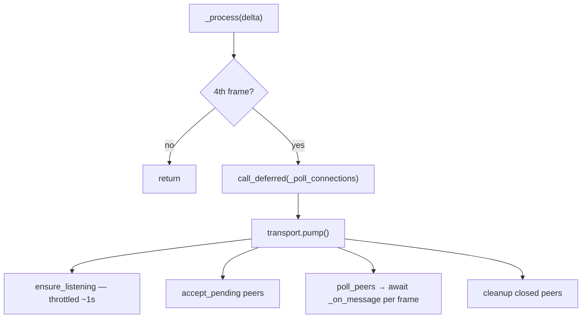
*Figure 4 — the deferred, frame-skipped editor poll · verified eb4c9fa*

The mutation **watchdog** ([§4](#4-dispatch--concurrency)) ticks every frame *unconditionally*
— independent of this poll cadence — so a wedged mutation is always recovered on time. Mode B,
running in a game with no `EditorFileSystem` re-entrancy to dodge, pumps **inline** every frame
with no `call_deferred` and no `await`.

---

## 4. Dispatch & concurrency

Once a request is authed and parsed, `server_request_router.gd` routes it. A few methods are
handled inline (`_cancel`, `echo`); an unknown method is a `-32601`. Everything else is
classified into one of **three execution lanes** by flags the command registry exposes.

<!-- data-depicts="addons/godot_mcp_toolkit/transport/dispatch/server_request_router.gd addons/godot_mcp_toolkit/transport/dispatch/dispatch_lane.gd" data-verified="eb4c9fa" -->
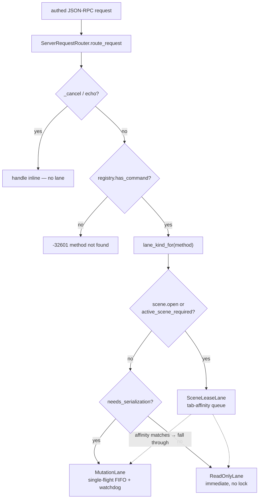
*Figure 5 — the three dispatch lanes · verified eb4c9fa*

- **ReadOnlyLane** — read-only commands bypass all locking and run immediately. They are
  marked `read_only`, which is *also* the value the server publishes as the tool's
  `readOnlyHint` — annotation correctness is load-bearing for **both** concurrency and the
  read-only filter ([§10](#10-security--trust-boundaries)).
- **MutationLane** — anything that mutates serialises **single-in-flight, FIFO**. A second
  mutation arriving while one is in flight gets a `_queued` notification and waits; on
  completion the lane `drain()`s the next. This is what makes blind, parallel LLM calls safe.
- **SceneLeaseLane** — commands that need a *specific* edited scene to be the active tab route
  through the scene lease, which queues them until that scene is active (and `scene.open`
  switches tabs). Once affinity matches, the request falls through to the mutation or read lane.

The **mutation watchdog** (`mutation_watchdog.gd`) is a separate object with its own lifecycle
so it can tick every frame regardless of poll state. It arms a per-mutation deadline and a
generation counter; if a mutation overruns, it emits a `-32000` timeout to the client,
cooperatively cancels the handler's `MCPToolkitToolContext`, bumps the generation (so the
wedged coroutine's tail bails), and force-clears the lock.

<!-- data-depicts="addons/godot_mcp_toolkit/transport/dispatch/dispatch_lane.gd addons/godot_mcp_toolkit/transport/dispatch/mutation_watchdog.gd" data-verified="eb4c9fa" -->
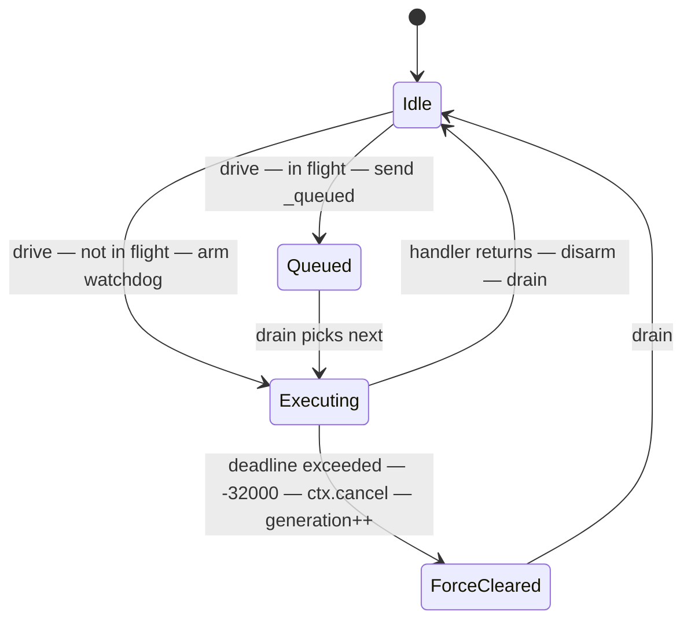
*Figure 6 — mutation lane single-flight + watchdog recovery · verified eb4c9fa*

The scene lease coordinates multiple connected peers against Godot's single active-scene-tab
model:

<!-- data-depicts="addons/godot_mcp_toolkit/scene/scene_lease.gd addons/godot_mcp_toolkit/transport/dispatch/dispatch_lane.gd" data-verified="eb4c9fa" -->
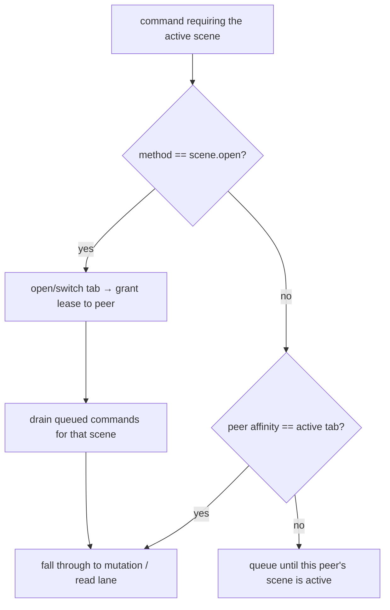
*Figure 7 — scene-lease lifecycle · verified eb4c9fa*

---

## 5. The response contract

Every handler returns a `Dictionary` in one of two shapes, and the registry **enforces** the
shape at dispatch ([ADR 0004](#14-key-decisions-adrs)) — a handler that returns a non-dict or
omits `success` is converted to an `INTERNAL` error rather than reaching the LLM malformed.

- **Success** — `MCPToolkitSuccess.ok(data)` returns `data` with `success: true` added.
  Success payloads never carry `code`.
- **Error** — `MCPToolkitError.fail(code, message, hint)` →
  `{"success": false, "error": <message>, "code": <code>}`, plus `"hint"` when one is passed
  or when `code` is in `DEFAULT_HINTS`. Error payloads never carry `status`.

**Error-code vocabulary.** `MCPToolkitError.CODES` is the closed set of **53** codes;
`DEFAULT_HINTS` auto-attaches a recovery hint for **7** of them (e.g. `TIMEOUT`,
`PATH_DENIED`, `GAME_NOT_RUNNING`, `RESPONSE_TOO_LARGE`). `LOG_BUSY` / `LOG_UNAVAILABLE` are
deliberately **not** in `DEFAULT_HINTS` — their recovery advice is version-gated (a
`source:"buffer"` fallback exists only on Godot 4.5+), so each emit site passes an explicit
version-gated hint instead. `fail()` asserts `code ∈ CODES` in debug builds, so a typo'd or
off-vocabulary code is caught at the source instead of drifting into the contract.

**Type coercion.** Godot's complex types cross JSON as **tagged dicts** and `coerce.gd`
translates them bidirectionally (`coerce_value` ⟷ `serialize_value`). There are **18 tags**:
`Vector2/3/4`, `Vector2i/3i`, `Color`, `Rect2/Rect2i`, `Transform2D/Transform3D`, `NodePath`,
`Resource`, `ResourceRef`, `NewResource`, `PackedVector2Array/PackedVector3Array/PackedColorArray`,
and `LayerMask`. An unknown tag is **rejected**, not passed through — the symmetry is the
contract.

**Idempotency** ([§contract C6](#13-contract-surface)). Create-style commands return a
`status` discriminator and accept `if_exists`, so a blind retry is safe by default:

<!-- data-depicts="addons/godot_mcp_toolkit/commands/scene_commands.gd addons/godot_mcp_toolkit/commands/resource_commands.gd addons/godot_mcp_toolkit/security/file_guard.gd" data-verified="25fcf46" -->
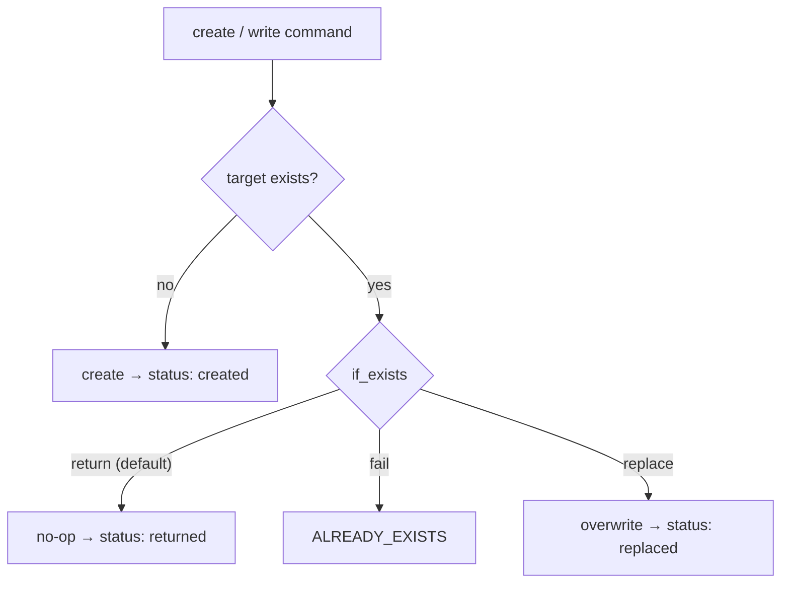
*Figure 8 — the idempotent create / if_exists decision · verified 3eeb924*

The shared `write_asset_with_settle` helper centralises the path-guard → extension-allowlist →
`if_exists` → write → import-settle bracket for assets/textures/sounds, so the idempotency
contract is one implementation, not three ([ADR 0010](#14-key-decisions-adrs)).

---

## 6. Command registry & catalogue

`MCPToolkitCommandRegistry` (`transport/mcp_toolkit_command_registry.gd`) is the central
dispatch table and the single seam the rest of the system routes through. Registration
(`add()`) version-gates the command, maps the friendly annotations to MCP hints, and clamps
the timeout to `[1s, 300s]`. Dispatch (`call_command()`) writes the audit entry, runs any
declarative path-guards ([ADR 0009](#14-key-decisions-adrs)), invokes the handler, and enforces
the response contract. The registry is also the **facade extensions call** ([§8](#8-extension-system)).

Built-in commands are registered by a single explicit enumerator,
`transport/builtin_command_registration.gd`, which calls each module's
`static register(registry, server)`. Each module owns one `domain.*` namespace and adds its
verbs with a fluent `MCPToolkitCommandOptions` describing the annotations:

```gdscript
static func register(registry: MCPToolkitCommandRegistry, server: Node) -> void:
    registry.add("scene.get_tree", func(parameters: Dictionary) -> Dictionary:
        return _cmd_scene_get_tree(parameters)
    , MCPToolkitCommandOptions.new().mark_read_only())
    registry.add("scene.create", func(parameters: Dictionary) -> Dictionary:
        return await _cmd_scene_create(parameters)
    , MCPToolkitCommandOptions.new().mark_scene_independent())
    # … more verbs
```

There are **~100 built-in handlers across 30 modules**; the server projects these to **110 MCP
tool definitions** (plus 2 meta tools registered separately), owns the tool **groups** and
on-demand activation, and the `domain.verb` ⟷ tool-name mapping stays in lockstep across the two
repos.

| Domain area | Modules (selected) |
|-------------|--------------------|
| Scene tree & node authoring | `scene_commands` (11), `node_commands` (9), `spatial_commands` |
| Script & code | `script_commands`, `commands/editor/editor_execute` (`execute.code`) |
| Resources, assets, files | `resource_commands`, `asset_commands`, `file_commands`, `folder_commands` |
| Visual & spatial | `3d_commands`, `path_commands`, `texture_commands`, `spriteframes_commands`, `theme_commands`, `tilemap_commands` |
| Tileset authoring | `commands/tileset/*` (11 verbs) |
| Procedural & synthesis | `procedural_commands`, `sound_commands`, `texture_commands` |
| Animation & particles | `animation_commands`, `particle_commands` |
| Audio | `audiobus_commands` |
| Input & navigation | `input_map_commands`, `navigation_commands` |
| Signals | `signal_commands` |
| Playtest & debug | `commands/playtest/*`, `debug_commands` |
| Editor, project, introspection, save | `commands/editor/*`, `classdb_commands`, `project_commands`, `save_commands`, `meta_commands` |

**The decomposition pattern.** The cohesion refactor that defines this version turned the
large files into a **thin orchestrator over single-responsibility children**. The registry's
own multi-instance store is the clearest example:

<!-- data-depicts="addons/godot_mcp_toolkit/registry/registry_client.gd addons/godot_mcp_toolkit/registry/store/registry_paths.gd addons/godot_mcp_toolkit/registry/store/registry_entry_file.gd addons/godot_mcp_toolkit/registry/store/registry_projection.gd addons/godot_mcp_toolkit/registry/store/file_lock.gd" data-verified="eb4c9fa" -->
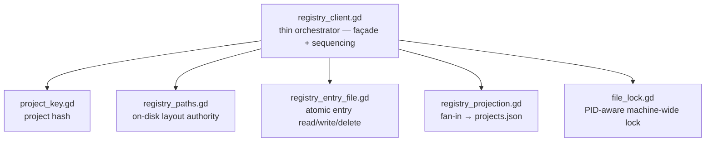
*Figure 9 — orchestrator + SRP-children (registry, concern 039) · verified eb4c9fa*

The same shape recurs across the codebase: `mcp_server.gd` over its transport/dispatch
children, `plugin.gd` over `PluginComposer` ([§7](#7-plugin-lifecycle)), `dock.gd` over its
panel components, `extension_loader.gd` over its services ([§8](#8-extension-system)), and the
former `tileset` / `editor` / `playtest` god-files over the leaves now under
`commands/tileset/`, `commands/editor/`, and `commands/playtest/`.

---

## 7. Plugin lifecycle

`plugin.gd` is a thin `EditorPlugin` (~172 lines). `_enter_tree` first **self-heals the runtime
autoload** via `AutoloadRegistration.ensure_registered()` — re-asserting `MCPRuntimeServer` before
the graph is wired if the project was enabled out-of-band with the `[autoload]` entry missing (ADR
0013) — then delegates the whole collaborator graph to `PluginComposer.compose()`, which returns a
`Handle`; `_exit_tree` calls `Handle.dispose()`, which tears the graph down in **exact reverse
order** — the add/remove symmetry (invariant I12) that keeps plugin reload clean. The autoload's
identity (name/path pairs + the `autoload/<name>` = `*<path>` derivation) lives in a pure-const
leaf (`core/autoload_identity.gd`) that both the registration module and the export-strip plugin
preload, so the two share one SSOT without coupling to each other.

<!-- data-depicts="addons/godot_mcp_toolkit/plugin.gd addons/godot_mcp_toolkit/core/plugin_composer.gd addons/godot_mcp_toolkit/core/autoload_registration.gd addons/godot_mcp_toolkit/core/autoload_identity.gd addons/godot_mcp_toolkit/ui/mcp_json_write_flow.gd addons/godot_mcp_toolkit/ui/toolkit_dialog_presenter.gd addons/godot_mcp_toolkit/transport/builtin_command_registration.gd" data-verified="8a1496e" -->
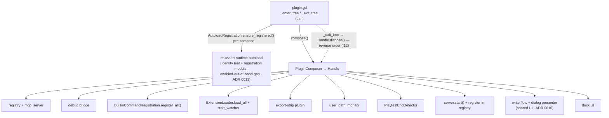
*Figure 10 — plugin composition root (concern 001) · verified 8a1496e*

The composer builds in a behaviour-critical order: registry and server first, then the debug
bridge, then all built-in commands, then extensions and their hot-reload watcher, the
export-strip plugin, the user-path monitor (which re-homes `user://` paths when the project is
renamed), the playtest-end detector, the server start + registry registration, then the shared
`.mcp.json` write-flow + dialog presenter, and finally the dock. The write-flow and dialog
presenter are **injected** into the dock, the tool menu, and the onboarding wizard alike — the
dock consumes them like any other UI surface rather than acting as a service locator for them
([ADR 0016](#14-key-decisions-adrs)). `dispose()` reverses the graph precisely, including the
I12-symmetric `PlaytestCommands.clear_debug_bridge()`; teardown uses **immediate (not deferred)
`free()`** throughout — for the dock control, the dialog presenter's dialogs, and the server, and
(in `plugin.gd`'s own `_exit_tree`) for the tool menu and the onboarding wizard — so nothing
outlives ObjectDB's exit-time leak check. The tool menu, per-user EditorSettings, the
Godot-version warning, and the onboarding wizard are wired by `plugin.gd` itself after compose
returns.

---

## 8. Extension system

Third parties add tools by shipping an `MCPToolkitExtension` subclass (GDScript) or an
`MCPToolkit`-prefixed `.cs` class (C#) anywhere in the project. The toolkit finds them by
**reflection over the global class list** — not a directory walk — and loads each through a
guarded lifecycle. `extension_loader.gd` is a 36-line orchestrator over four services under
`extensions/services/`: `extension_discovery` (one-shot startup pass), `extension_support`
(the shared load/validate/probe leaf), `extension_watcher` (live hot-reload), and
`extension_meta_commands` (the `extensions.list` surface).

<!-- data-depicts="addons/godot_mcp_toolkit/extensions/extension_loader.gd addons/godot_mcp_toolkit/extensions/services/extension_discovery.gd addons/godot_mcp_toolkit/extensions/services/extension_support.gd addons/godot_mcp_toolkit/extensions/services/extension_watcher.gd" data-verified="eb4c9fa" -->
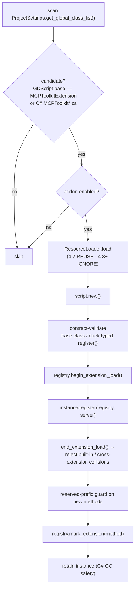
*Figure 11 — extension discovery → validate → guarded register (concern 047) · verified eb4c9fa*

Two guards protect the built-in surface: a **collision guard** window (opened by
`begin_extension_load`, drained by `end_extension_load`) rejects an extension that tries to
overwrite a built-in or another extension's command, and a **reserved-prefix** check forbids
new commands under the built-in namespaces (`scene.`, `node.`, `runtime.`, …). The threat model
treats extensions as **full-trust** ([ADR 0009](#14-key-decisions-adrs)) — these guards prevent
*accidental* collision, not malice.

**Single-level discovery** ([ADR 0005](#14-key-decisions-adrs)) avoids the last-writer-wins
double-registration that nested discovery would cause, and it matches what the export strip
removes. Loaded instances are **retained on a registry meta array** because a C# extension's
registered `Callable`s are bound to its instance; without a live reference the GC would collect
it and break the callbacks.

**Hot-reload.** `extension_watcher` listens for `EditorFileSystem.filesystem_changed` and
`ProjectSettings.settings_changed`, debounces ~500 ms, computes an added/removed/modified class
diff (with a source-hash fallback for in-session edits on Godot 4.2), applies it, and broadcasts
`extensions.changed` to all authed peers. `extensions.list` / `extensions.refresh` are the pull
counterparts. (Because Claude Code drops `tools/list_changed` notifications, the bridge cannot
rely on the broadcast alone — the pull path is the reliable one.)

**The extension API** is the nine public `MCPToolkit*` classes plus the registry facade. C#
extensions in particular cannot `await` GDScript statics, so the `registry` handed to
`register()` exposes everything they need as plain methods: `create_options` /
`create_extension_options` / `create_undo_action` / `queue_save` / `check_save` / `fail` /
`require`. Cancellable handlers receive an `MCPToolkitToolContext` second argument and poll
`is_cancelled()`.

---

## 9. Multi-project registry

The bridge has to find every editor and every running game on the machine. The toolkit solves
this **lock-light**: each instance writes its **own** entry file, and a locked rebuild fans
them into the single `projects.json` the bridge reads.

<!-- data-depicts="addons/godot_mcp_toolkit/registry/registry_client.gd addons/godot_mcp_toolkit/registry/store/registry_projection.gd addons/godot_mcp_toolkit/registry/store/file_lock.gd" data-verified="eb4c9fa" -->
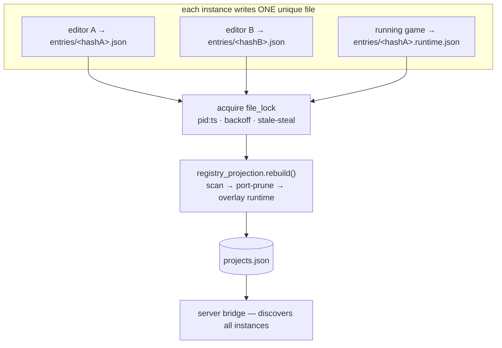
*Figure 12 — registry fan-in (concern 039) · verified eb4c9fa*

The registry directory is **machine-wide**, not `user://` — `%APPDATA%\godot-mcp-toolkit` on
Windows, `~/Library/Application Support/godot-mcp-toolkit` on macOS, `$XDG_DATA_HOME` on Linux —
so independent editors share it. Because every writer owns a unique file (keyed by a 12-hex
project hash, with the runtime writing a separate `.runtime.json`), there is **no contention on
the writes**; the `file_lock` only serialises the *rebuild*. The lock stores `pid:ts`, backs off
exponentially, steals a lock whose PID is dead or older than 10 s, and force-writes after the
retry budget so a caller always makes progress. Rebuild output is written two-phase
(`.tmp` → `.bak` → target) so a crash never leaves a half-written `projects.json`. GC is by
port-conflict pruning only — PID-based GC was removed because Windows' `OS.is_process_running()`
reports false positives for live sibling editors.

---

## 10. Security & trust boundaries

The toolkit assumes a **single local user with a human at the editor**; the boundary is
localhost + token, not a defence against an adversary who can already write project files.
Within that model, several layers keep an LLM's requests honest.

<!-- data-depicts="addons/godot_mcp_toolkit/security/auth.gd addons/godot_mcp_toolkit/security/file_guard.gd addons/godot_mcp_toolkit/security/audit.gd addons/godot_mcp_toolkit/security/untrusted.gd addons/godot_mcp_toolkit/security/scrubber.gd addons/godot_mcp_toolkit/transport/mcp_toolkit_command_registry.gd" data-verified="eb4c9fa" -->
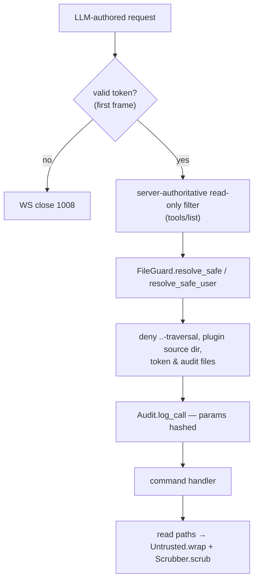
*Figure 13 — request trust boundaries · verified eb4c9fa*

- **FileGuard** (`security/file_guard.gd`) is the path keystone: `resolve_safe` confines writes
  to `res://` (rejecting `..` traversal and absolute OS paths via a globalize → simplify →
  re-verify pass), and `resolve_safe_user` confines `save.*` to `user://` while **denying the
  plugin's own internal directory** — that denial is what protects the token and audit files
  from being read or rewritten through the tools.
- **Read-only is server-authoritative.** The toolkit does **not** gate dispatch on
  `GODOT_MCP_READ_ONLY`; the server filters `tools/list` by the `readOnlyHint` /
  `destructiveHint` the toolkit publishes. The toolkit consumes its own `read_only` flag only
  for concurrency routing and a best-effort dock badge. (Gating dispatch on a mirrored env var
  is exactly the desync bug an earlier feature-gate subsystem had, and was removed.)
- **Audit** (`security/audit.gd`) appends an intent trail — ISO-8601 timestamp, method, and the
  **SHA-256 of the params** (not the plaintext, so no secret leaks) — for both lanes, in the
  token-protected instance directory.
- **Untrusted content** read back from the project (script text, console output) is wrapped in
  a nonce-delimited `<untrusted-…>` envelope (with pre-existing tags scrubbed to prevent
  breakout) and run through `Scrubber` to redact secrets before it reaches the LLM. This applies
  to read paths only, never to writes or binary.

---

## 11. Cross-version compatibility

The toolkit supports **Godot 4.2 (floor) through 4.7** (`GODOT_TESTED_MAX_VERSION`), on the same
parse-time principle as the editor↔runtime split: a version-specific API that doesn't exist in an
older engine **must not appear as an identifier**, or the script won't parse there. So version-specific features are
reached by **dynamic dispatch** — `has_method()` + `call()`, `has_signal()`,
`ClassDB.class_exists()`, `is_class()` — never by naming the new symbol directly.

`MCPVersionUtils` (`versioning/mcp_version_utils.gd`, pure static and editor-clean) is the
comparison helper. There are two gating layers: a **registration hard-gate** (`registry.add`
blocks a command whose `min`/`max` Godot version doesn't match — e.g. `scene.close` is 4.5+),
and **in-handler capability checks** that degrade gracefully (e.g. an AnimationTree listing
returns `[]` below 4.5). A forward-compat warning fires (non-blocking) when the running engine
is newer than the tested maximum. Parse-time syntax gates (typed dictionaries 4.4+, `@abstract`
4.5+, `@export_tool_button` 4.4+) are simply kept out of the source.

---

## 12. Distribution

The two repos ship through **different channels** so users never fetch what they don't need
(Pattern B):

- **Toolkit** → the **Godot Asset Library** (the GitHub archive) plus a GitHub-Releases zip
  built by `scripts/build-plugin-release.{ps1,sh}`. The package contains **only** the
  `addons/godot_mcp_toolkit/` subtree — which is why this `docs/` folder, the ADRs, and the dev
  docs never reach end users. `plugin.cfg` declares the version and the `plugin.gd` entry point;
  `icon.png` / `icon.svg` at the repo root are for the Asset Library listing.
- **Server** → **npm** (`@npgamedev/godot-mcp-server`).

The export-strip plugin ([ADR 0006](#14-key-decisions-adrs)) is a *separate* concern: it protects
a toolkit **user's** game export (nulling the runtime autoload, stripping addon source) — distinct
from how the toolkit itself is shipped.

---

## 13. Contract surface

The **contract surface** is the published language the server depends on — the part of this
toolkit that is *not* free to change without coordinating the bridge. It is catalogued in full
(with toolkit-side `file:line`, field types, example payloads, and stability tiers) in the 41n
contract-surface document; the headline rows:

| # | Contract | Tier |
|---|----------|------|
| C1 | WebSocket transport & framing (ports, bind, buffer) | public |
| C2 | Auth handshake (first-frame token; mode-divergent reply) | public |
| C3 | Response envelope (`success` / `error` shape) | public |
| C4 | Error-code vocabulary (`CODES`, 53) | public |
| C5 | Dispatch + concurrency notifications (`_queued` / `_executing` / `_cancel`; id coercion; JSON-RPC codes) | public |
| C6 | Idempotency (`status` + `if_exists`) | public |
| C7 | Type-tag coercion vocabulary (18 tags, bidirectional) | public |
| C8 | Tool names & param schemas (`domain.verb`) | public |
| C9 | Read-only model (server-authoritative; published annotations) | public |
| C10 | Environment variables | public |
| C11 | `.mcp.json` file format | public |
| C12 | Tool group names | semi-public |
| C13 | Extension API (`register`; registry facades; base classes) | semi-public |
| C14 | Extension surface signaling (`extensions.list` / `refresh` / `changed`) | semi-public |
| C15 | LSP status round-trip (server → toolkit `set_lsp_status`) | semi-public |
| C16–C22 | `projects.json` format, project hash, token-path discovery, LSP/runtime publishing, untrusted envelope, ProjectSettings keys | internal |

Tiers feed semver: **public** = a break is a major bump; **semi-public** = deprecate-then-change
in a minor; **internal** = no guarantee. The server-side consumer of each contract is verified
in the server's own review (41n-bis), and the two sides are reconciled in 41n-ter.

---

## 14. Key decisions (ADRs)

Architectural decisions are recorded in [`docs/adr/`](../adr/) (toolkit repo, unshipped). The
ones most relevant to this document:

| ADR | Decision | Where it shows up |
|-----|----------|-------------------|
| [0003](../adr/0003-typed-command-options-builder.md) | Typed command-options builder (`MCPToolkitCommandOptions`) | [§6](#6-command-registry--catalogue) |
| [0004](../adr/0004-enforce-response-contract-at-dispatch.md) | Enforce the response contract at dispatch | [§5](#5-the-response-contract) |
| [0005](../adr/0005-single-level-extension-discovery.md) | Single-level extension discovery (+ matching export strip) | [§8](#8-extension-system) |
| [0006](../adr/0006-binary-token-export-warn-not-strip.md) | Warn, don't strip, binary-token GDScript exports | [§2](#2-the-editorruntime-split), [§12](#12-distribution) |
| [0007](../adr/0007-unfocused-responsive-mode.md) | Opt-in, machine-wide, crash-safe unfocused-responsive mode | [§3](#3-transport--connection) |
| [0008](../adr/0008-lsp-port-registry-authoritative.md) | LSP port discovery is registry-authoritative | [§2](#2-the-editorruntime-split), [§9](#9-multi-project-registry) |
| [0009](../adr/0009-fs-content-trust-boundary.md) | Filesystem-content trust boundary; extensions are full-trust | [§8](#8-extension-system), [§10](#10-security--trust-boundaries) |
| [0010](../adr/0010-generated-assets-report-constructed-class.md) | Generated assets report their constructed class & skip import-settle | [§5](#5-the-response-contract) |
| [0011](../adr/0011-token-path-authority.md) | Token-path authority — the toolkit publishes the globalized-absolute path; the server reads & structurally validates it | [§3](#3-transport--connection), [§10](#10-security--trust-boundaries) |
| [0013](../adr/0013-runtime-autoload-self-heal.md) | Self-heal the runtime autoload on load when enabled out-of-band | [§7](#7-plugin-lifecycle) |
| [0014](../adr/0014-headless-dx-response-shape.md) | Headless-DX response shape (`headless` handshake field + degraded-tool guidance) | [§3](#3-transport--connection) |
| [0015](../adr/0015-deterministic-port-config.md) | Deterministic env-driven listen-port config (pin/band, bind-exact-or-fail) | [§3](#3-transport--connection) |
| [0016](../adr/0016-dock-not-a-service-locator.md) | The dock is a UI surface, not a service locator (shared write-flow + dialog presenter injected) | [§7](#7-plugin-lifecycle) |
| [0017](../adr/0017-macos-gui-launch-path.md) | OS-aware `.mcp.json` emission — resolve a macOS GUI-launch absolute node path (superseded by 0018) | [§3](#3-transport--connection), [§7](#7-plugin-lifecycle) |
| [0018](../adr/0018-macos-launch-minimize.md) | Minimize the macOS `.mcp.json` emission — revert to bare npx (supersedes 0017) | [§3](#3-transport--connection), [§7](#7-plugin-lifecycle) |

---

*This architecture document is part of the toolkit repo and is not shipped in the addon
package. The server's architecture is documented separately in the
[`godot-mcp-server`](https://github.com/NPGameDev/godot-mcp-server) repo.*
